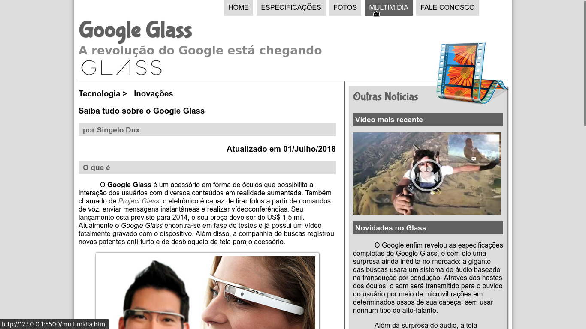
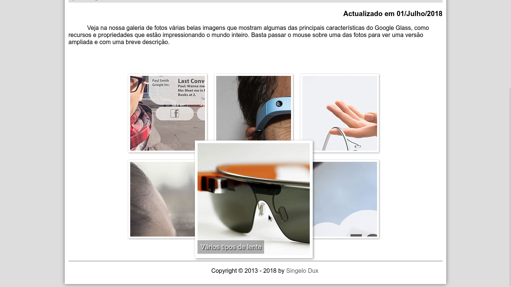
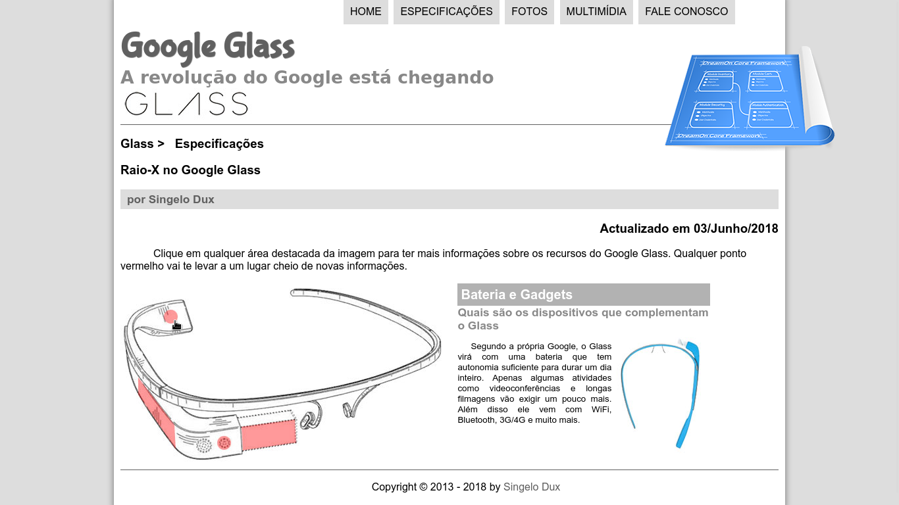
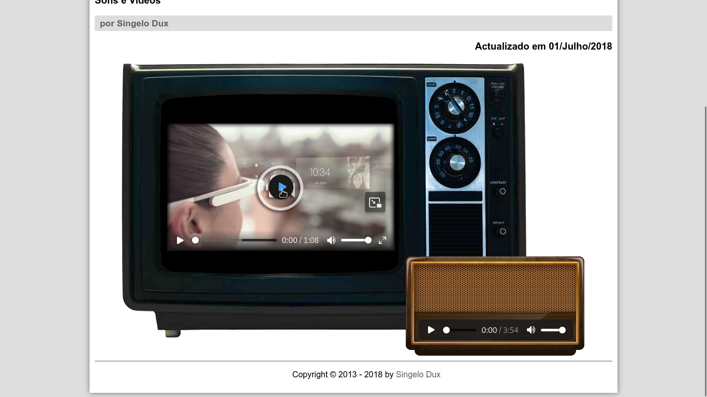

# Projeto Glass HTML5 - 2018 👓✨

Este repositório contém o projeto desenvolvido durante o curso **HTML5 + CSS3 + JavaScript Completo e GRÁTIS** de 2013, oferecido por [Curso em Vídeo](https://www.cursoemvideo.com/). Foi uma experiência transformadora, que me permitiu construir um site funcional e aprender as tecnologias base para o desenvolvimento web! 💻🌐

No decorrer do curso, aprendi a estruturar páginas, estilizar interfaces e integrar scripts, tudo isso enquanto construía um site completo para o projeto fictício "Google Glass". Este repositório reflete o resultado dessa jornada, onde tive a oportunidade de aprender e aplicar os conceitos de HTML5, CSS3 e JavaScript.

**PS:** 2018 foi o ano em que fiz o curso e coloquei o projeto em prática!

---

## 🎯 Como Acessar

O projeto está disponível no GitHub Pages para acesso rápido:  
👉 [Acesse aqui o site do projeto](https://singelodux.github.io/projeto-glass-html5-2018/)

---

## 🖼️ Imagens e Capturas de Tela

1. Página Inicial
   

2. Galeria de Fotos
     

3. Especificações
     

4. Multimídia
   

---

## 📂 Estrutura do Projeto

```plaintext
projeto-glass-html5/
    css/            # Arquivos de estilo CSS utilizados no projeto
    extras/          # Pacotes adicionais, como fontes ou imagens de apoio
    fonts/          # Fontes especiais utilizadas no design
    imagens/        # Imagens usadas no site
    interface/      # Estrutura de referência para o design final do projeto
    javascript/     # Scripts JavaScript para funcionalidades do site
    media/          # Arquivos de áudio e vídeo utilizados
    textos/         # Textos e conteúdos textuais usados no site

    fale-conosco.html     # Página de contato
    fotos.html            # Galeria de fotos
    google-glass.html     # Página inicial do projeto
    index.html            # Página principal do site
    multimidia.html       # Seção de multimídia
    specs.html            # Especificações técnicas
    testejs.html          # Testes de scripts JavaScript
    testejs02.html        # Teste adicional de JavaScript
    testejs03.html        # Mais testes de JavaScript
```

---

## 📝 Observações Importantes

Durante o desenvolvimento do projeto, segui fielmente a proposta do curso, mantendo inclusive o padrão de nomenclatura com o caractere de underline (`_`) no início dos diretórios, como, por exemplo, `_imagens/`. Este padrão funcionou bem localmente, mas ao fazer o deploy no GitHub Pages, surgiram problemas no carregamento de recursos como **CSS**, **JavaScript**, **imagens** e **vídeos**.

Inicialmente, movi o arquivo CSS para a raiz do projeto, o que resolveu o problema do carregamento do CSS. No entanto, outros recursos continuaram não sendo carregados corretamente. Testei várias abordagens, incluindo o uso do `<base href="#">`, mas o problema persistia.

Após um diagnóstico mais detalhado, percebi que a causa principal estava nos **diretórios com "_" no nome**, como `_imagens/`. Além disso, também descobri que **caminhos relativos com barra inicial** (exemplo: `/imagens/`) não estavam funcionando, enquanto **caminhos relativos sem barra** (exemplo: `imagens/` ou `./imagens/`) carregavam corretamente.

### Resumo

- **Diretórios com "_" no nome** causaram problemas de carregamento no GitHub Pages.
- **Caminhos relativos com barra inicial** (exemplo: `/imagens/`) não funcionaram corretamente.
- A solução foi **remover o "_" dos nomes dos diretórios** e utilizar **caminhos relativos sem barra inicial** (por exemplo, `imagens/` ou `./imagens/`).

Embora o uso de `./imagens/` funcione, optei por `imagens/` por questões de maior compatibilidade. Essas alterações garantiram que todos os recursos fossem carregados corretamente, tanto no ambiente local quanto no GitHub Pages.

---

## 🚀 O que Aprendi

Alguns tópicos abordados no curso:  

- Estrutura básica de uma página HTML5 🏗️  
- Formatação e estilização com CSS3 🎨  
- Efeitos visuais e semântica em HTML5 🔍  
- Introdução ao JavaScript e sua integração com HTML5 🛠️  
- Criação de tabelas, formulários e álbuns de fotos 📸  
- Reprodução de áudio e vídeo em HTML5 🎥🎵  

---

## 📜 Recursos de Apoio

- [Repositório Oficial do Curso](https://github.com/cursoemvideo/cursoemvideo-html5)  
- [Curso Grátis no Curso em Vídeo](https://www.cursoemvideo.com/curso/html5/)  
- [Playlist no YouTube](https://www.youtube.com/watch?v=epDCjksKMok&list=PLHz_AreHm4dlAnJ_jJtV29RFxnPHDuk9o)  
- [Perfil do Gustavo Guanabara](https://github.com/gustavoguanabara)  

---

## 💡 Por Que Publicar Este Projeto?

Este projeto representa um marco no meu aprendizado de desenvolvimento web, e ainda me deu um ótimo portfólio para exibir no GitHub.

Durante esse processo, aproveitei para explorar recursos como GitHub Pages, o que expandiu meu conhecimento sobre as ferramentas da plataforma. Além disso, compartilhar meu aprendizado pode servir como referência e inspiração para outros desenvolvedores iniciantes que também estão começando suas jornadas. 😊

---
